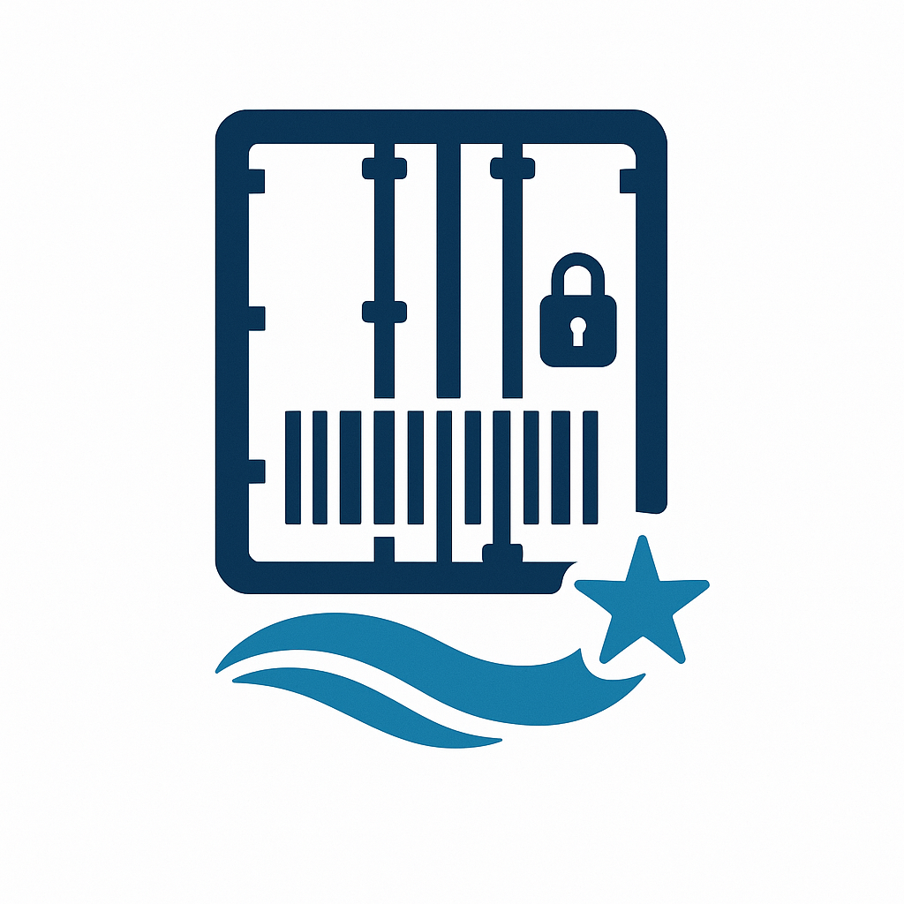

<p align="center">
  <br>
  <span style="font-size:2em;"><b>ContainerVision Marsa_Maroc</b></span><br>
  <i>AI solution for automated container ID and seal recognition at Marsa Maroc terminals.</i>
</p>

<hr style="height:5px; background:#1976d2; border:none;">

## 🚢 Project Overview

ContainerVision leverages OCR and computer vision to automatically extract container shipping information and detect seals from images.  
Designed for deployment at Marsa Maroc terminals to improve efficiency and accuracy in container handling.

---

## 🎬 Demo

<p align="center">
  
</p>

---

## 📁 Folder Structure

```
.
├── README.md
├── requirements.txt
├── app.py                  # Flask API for web interface
├── main.py                 # Main entry point for detection
├── src/                    # Source code (pipelines, models, utils)
├── app_container/          # Desktop GUI (Tkinter)
│   ├── app2.py
│   └── (other modules, weights)
├── data/                   # Data samples
│   ├── labeled_samples/
│   ├── organised_samples/
│   ├── seal_cropped_images/
│   └── test/
├── notebook/               # Jupyter notebooks
├── runs/                   # Model outputs
├── templates/              # Flask HTML templates
└── .github/                # GitHub workflows
```

---

## 🚀 Getting Started

### Prerequisites

- Python 3.8+
- [pip](https://pip.pypa.io/en/stable/)
- [YOLOv8](https://docs.ultralytics.com/)
- (Optional) [virtualenv](https://virtualenv.pypa.io/en/latest/)

### Installation

1. **Clone the repository:**

   ```sh
   git clone https://github.com/Ismailea4/ContainerVision-Marsa_Maroc.git
   cd ContainerVision-Marsa_Maroc
   ```

2. **Create and activate a virtual environment (recommended):**

   ```sh
   python -m venv env
   .\env\Scripts\activate
   ```

3. **Install dependencies:**
   ```sh
   pip install -r requirements.txt
   ```

### Data

- Place your raw and processed data in the `data/` directory.
- **Note:** Large datasets and model weights should not be pushed to GitHub. Use `.gitignore` to exclude them.

---

## ⚡ Usage

### Command Line Detection

Run detection and OCR using the main script:

```sh
python main.py --image data/test/1-153655001-OCR-RF-D01.jpg --model weights/best.pt --object_type code seal --display --output result.jpg
```

**Arguments:**
- `--image`: Path to the input image or directory (required)
- `--model`: Path to YOLO model weights
- `--object_type`: List of object types to detect (`code`, `seal`, `character`)
- `--conf`: Confidence threshold (default: `0.25`)
- `--iou`: IoU threshold (default: `0.45`)
- `--display`: Show the image with predictions
- `--output`: Path to save the output image

### Using the Pipeline in Python

```python
from src.pipeline import container_detection

result = container_detection(
    image_path = 'data/test/1-153655001-OCR-RF-D01.jpg',
    model_path = 'weights/best.pt',
    object_type=['code', 'seal'],
    conf=0.25,
    iou=0.45,
    display=True
)
print("Detections:", result['detections'])

import cv2
cv2.imwrite('output_with_predictions.jpg', result['predictions'])
```

---

### Streamlit Web App

Start the Streamlit web app:

```sh
streamlit run app.py
```
- Open [http://localhost:8501/](http://localhost:8501/) in your browser.
- Use the interface to upload images, run detection, and view results interactively.

---

### Desktop App (Tkinter GUI)

If you prefer a standalone desktop application, you can use the Tkinter-based GUI provided in [`app_container/app2.py`](app_container/app2.py).

#### Download

- Download the latest release from the [Releases](https://github.com/Ismailea4/ContainerVision-Marsa_Maroc/releases) page (if available), or clone the repository and navigate to the `app_container` folder.

#### Usage

1. **Install dependencies** (from the root or `app_container` folder):

    ```sh
    pip install -r app_container/requirements.txt
    ```

2. **Run the desktop app:**

    ```sh
    python app_container/app2.py
    ```

3. **How to use:**
    - Click "Select Image" to upload a container image.
    - Click "Start Detection" to run OCR and seal detection.
    - View results, copy predictions, and save processed images directly from the app interface.

---

### Notebooks

Explore and test models in the [`notebook/`](notebook/) directory.

---

## 🏋️ Training

1. Prepare your dataset in YOLO format (see `prepare_yolo.py` or notebooks).
2. Train your model using YOLOv8 or your preferred framework.

---

## 🤝 Contributing

Pull requests are welcome. For major changes, please open an issue first to discuss what you would like to change.

---

## 📄 License

[MIT](LICENSE)

---

## 🙏 Acknowledgements

- Marsa Maroc
- Ultralytics YOLO
- OpenCV, Tesseract OCR

---

<p align="center">
  <b>For more details, see the code and comments in each directory.</b>
</p>
