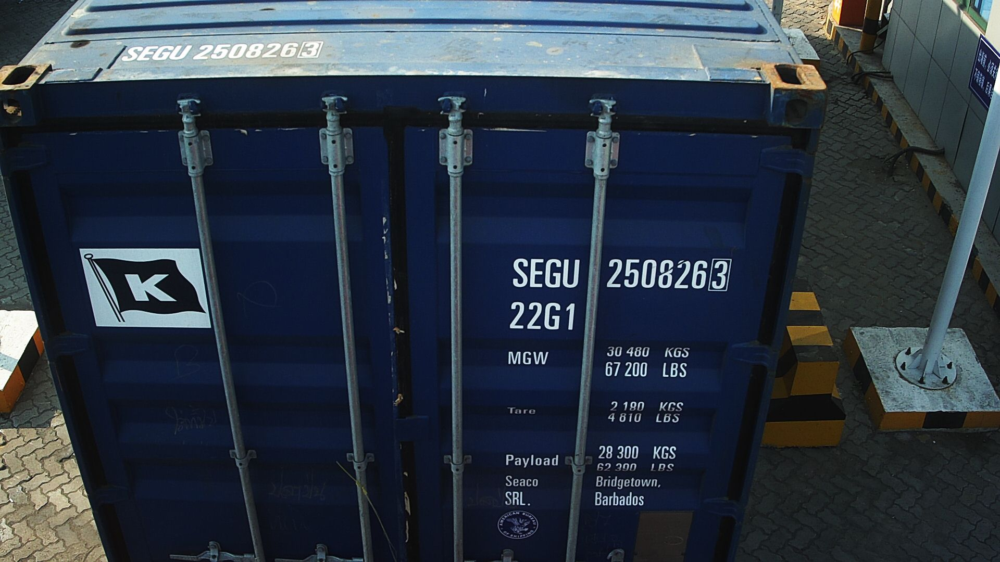

# Data Folder

This folder contains all the image data used for training, validation, and testing of the ContainerVision-Marsa_Maroc project.

## Folder Structure

- **labeled_samples/**  
  Contains subfolders for each container, with images that have been manually labeled for container codes and seals.

- **organised_samples/**  
  Similar to `labeled_samples`, but images are organized for easier access and processing, typically grouped by container ID.

- **seal_cropped_images/**  
  Contains cropped images of seals (both sealed and unsealed) extracted from the original container images.  
  *Example filename:* `1-122720001-OCR-AS-B01_unsealed_0.jpg`

- **test/**  
  Contains sample images for testing the detection and OCR pipelines.

---

## Image Types

Each image filename contains a code indicating the camera/viewpoint. There are **five types of images**:

| Type | Description                        | Example Filename (one line)                                   |
|------|------------------------------------|---------------------------------------------------------------|
| LF   | Left Front                         |  |
| RF   | Right Front                        |  |
| LB   | Left Back                          |  |
| AH   | Above Horizontal (Top view)        |  |
| AS   | Above Side (Side-top/Angular view) |  |

You can identify the type by looking for `LF`, `RF`, `LB`, `AH`, or `AS` in the filename.

---

## Download the Full Dataset

To access the complete dataset, use the following Google Drive link:  
[ContainerVision Dataset on Google Drive](https://drive.google.com/drive/folders/13LpHEeFExmDJnw_U9peqLR-8uAAUMEzi)

---

## Notes

- Only a subset of the data is included in this repository. Please use the Google Drive link for the full dataset.
- For annotation details and label formats, see the main project [README.md](../README.md) and the `cvat_annotation/` folder.
- Do not push large files or the full dataset to the repository; use `.gitignore` to