# src Directory

This folder contains the core source code for the ContainerVision-Marsa_Maroc project.

---

## Pipeline Stages Overview

The pipeline for container code and seal recognition consists of **six main stages**. Each stage is explained below with example images from [`docs/exemple/`](../docs/exemple):

### **Stage 1: Detect Container Number & ISO Code Bounding Boxes**

Detect the bounding boxes for the container number and ISO code on the container image.

<p align="center">
  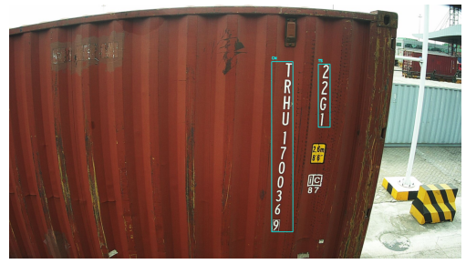
</p>

---

### **Stage 2: Detect Character Bounding Boxes**

Within the detected code regions, detect the bounding boxes for each individual character.

<p align="center">
  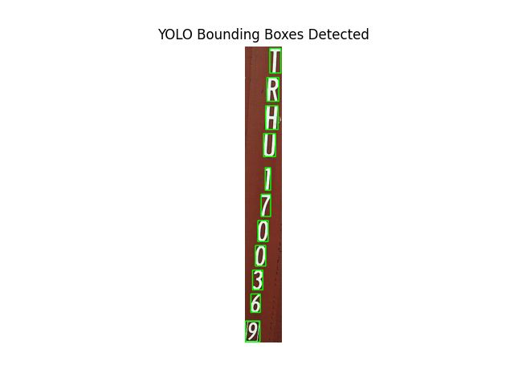
  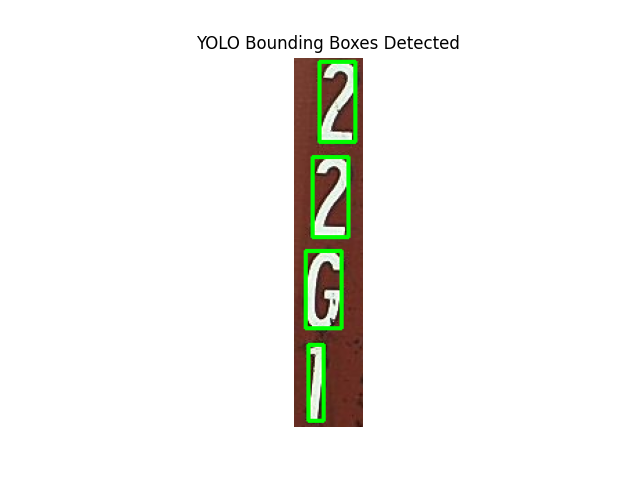
</p>

---

### **Stage 3: Preprocess Cropped Character Images**

Apply morphological operations and convert each cropped character image to binary (black and white) for better recognition.

<p align="center">
  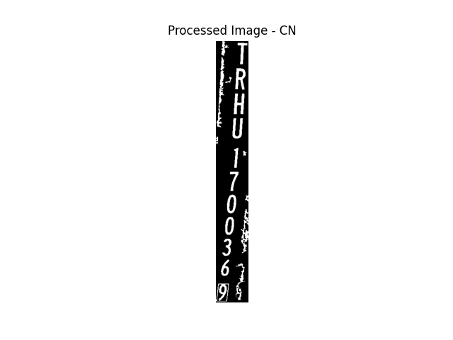
  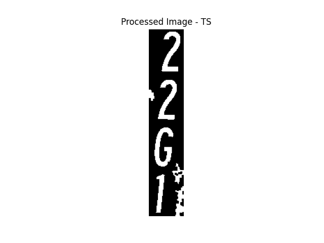
</p>

---

### **Bonus: Reconstitute & Align Characters**

(Optional) Reconstitute the sequence of character images to ensure horizontal alignment if needed.


<div style="display: flex; align-items: center;">
  

  <div style="width: 2px; background-color: gray; height: 100px; margin: 0 100px;"></div>

  
</div>

---

### **Stage 4: Recognize Each Character**

Run OCR on each processed character image to recognize the character.

<p align="center">
  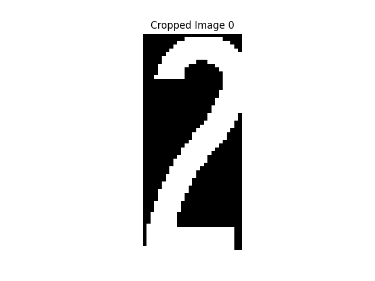
  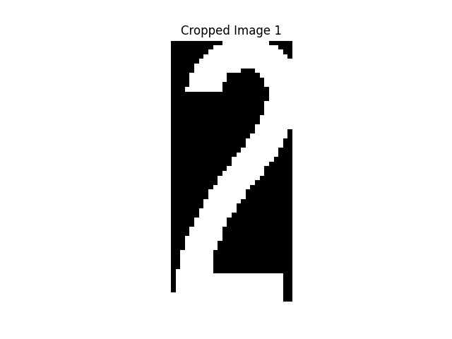
  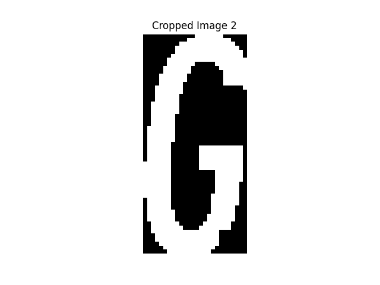
  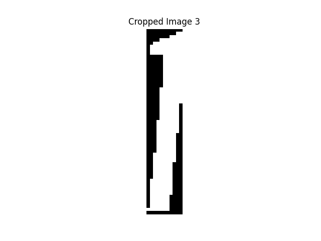
</p>

---

### **Stage 5: Regroup Characters to Form the Code**

Regroup the recognized characters to reconstruct the full container number and ISO code.

<p align="center">
  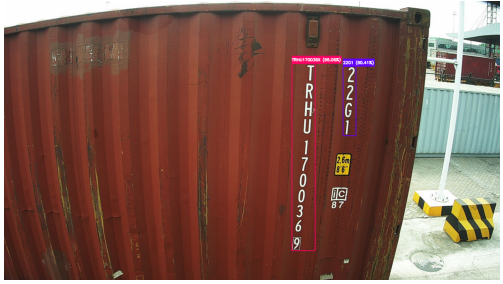
</p>

---

### **Stage 6: Seal Detection**

Detect and classify seals (sealed/unsealed) on the container using object detection.

<p align="center">
  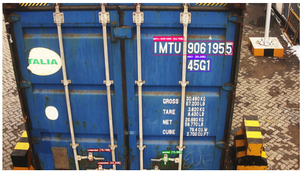
</p>

---

## Typical Workflow

1. **Data Preparation**

   - Use `data_preparation.py` to preprocess images and generate labeled data for training and evaluation.
   - Example: Draw bounding boxes, create label files, extract seal regions.

2. **Model Loading and Detection**

   - `models_detection.py` provides functions to load YOLO and character CNN models.
   - Detection and recognition are performed using these models.

3. **Pipeline Execution**
   - The main pipeline functions in `pipeline.py` orchestrate the detection, OCR, and seal classification.
   - These functions are called by the main application (`main.py`) or the Streamlit API (`app.py`).

---

## Main Pipeline Function Example

The main function for running the full pipeline is `container_detection`.  
Here is a typical usage example:

```python
from src.pipeline import container_detection

result = container_detection(
    image_path="path/to/image.jpg",
    model_path="weights/best.pt",
    object_type=['code', 'character', 'seal'],
    conf=0.25,
    iou=0.45,
    display=True
)

print("Detections:", result['detections'])
# result['predictions'] contains the annotated image
```

---

## Example Usage

```python
from src.pipeline import container_OCR, container_seal

result = container_OCR("path/to/image.jpg")
print(result['detections'])

seal_result = container_seal("path/to/image.jpg")
print(seal_result['detections'])
```

---

## Code Verification: Check Digit Concept

Container codes (CN) follow the ISO 6346 standard, which includes a **check digit** to ensure the code is valid.  
The check digit is calculated using a specific algorithm that assigns numerical values to letters, applies a weighted sum, and compares the result to the last digit of the code.

### **How It Works**

1. **Assign Values to Letters:**  
   Each letter in the first 4 characters is assigned a value according to the ISO standard (see image below).

   <p align="center">
     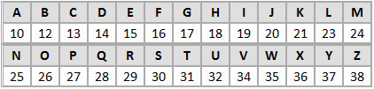
   </p>

2. **Apply Multiplication Factors:**  
   Each character (letter or digit) is multiplied by a factor (2^position), where position starts at 0 for the leftmost character.

   <p align="center">
     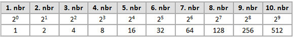
   </p>

3. **Sum and Modulo:**  
   The sum of all products is calculated. If the sum modulo 11 is 10, it is replaced by 0.  
   The result should match the last digit of the container code (the check digit).

---

### **Example**

Suppose we have the container code:  
`MSCU1234565`

- **Step 1:** Assign values to `M`, `S`, `C`, `U` using the mapping.
- **Step 2:** Multiply each character by its factor (2^position).
- **Step 3:** Add the products and compute modulo 11.
- **Step 4:** Compare the result to the last digit (`5`). If they match, the code is valid.

---

### **Visual Example**

<p align="center">
  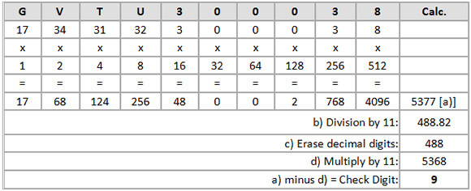
</p>

---

### **In the Pipeline**

The function `check_digit_verification` in [`pipeline.py`](pipeline.py) implements this logic.  
It is used in the code verification step to ensure that only valid container codes are accepted.

```python
from src.pipeline import check_digit_verification

code = {"CN": "MSCU1234565"}
is_valid = check_digit_verification(code)
print("Valid code!" if is_valid else "Invalid code!")
```

---

**This step helps prevent errors and ensures the reliability of container identification.**

---

## Notes

- Do not modify or remove model files (`*.pth`) unless you are updating the trained weights.
- For detailed usage, see the main project [README.md](../README.md).
- For annotation and data conversion scripts, see `data_preparation.py`.

---

For any questions about the code in this folder, please refer to the docstrings in each file or open an issue in the
